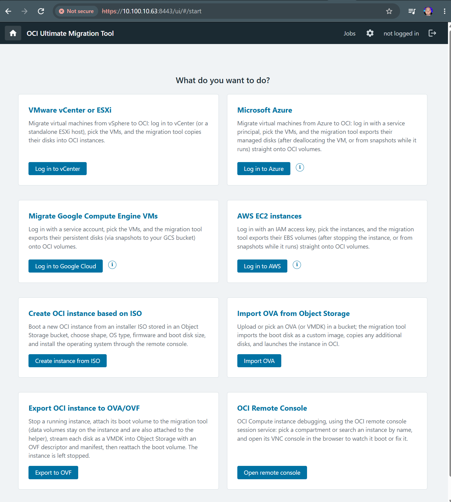

# OCI Ultimate Migration Tool

The **OCI Ultimate Migration Tool** brings virtual machines into Oracle Cloud Infrastructure. It runs as a
single VM in your OCI tenancy with a web UI: log in to the source platform, pick the VMs, choose where they
should land in OCI, and follow the progress. The tool creates OCI instances from the source disks and maps
firmware and sizing to supported OCI options. Review the [guest prerequisites and limitations](docs/limitations.md)
before migration; some guests need driver installation or manual configuration to boot correctly.

**Migrate from**

- **VMware** - vCenter or a standalone ESXi host
- **Microsoft Azure**
- **Amazon Web Services** - EC2 instances
- **Google Cloud** - Compute Engine VMs
- **Manual import** - an OVA/OVF (or VMDK) uploaded to OCI Object Storage

**Extra features**

- **Create OCI instance from ISO** - boot a new instance from an installer ISO and install the OS through a Remote console session
- **OCI Remote Console** - open the VNC console of any compute instance in your browser
- **Export from OCI to OVA/OVF** - turn an OCI instance into an OVA/OVF package in Object Storage

Linux guests support optional initramfs, DHCP network and cloud-agent fixes on the OCI copy. Windows
guests may need VirtIO drivers installed before migration. Live migration with delta sync, VMware
Workstation/Fusion, Hyper-V and KVM sources are not supported. See [docs/limitations.md](docs/limitations.md).

## Quick start

The button uses a verified stack revision. If an already-open Create stack page shows an older
description, close it and open the button again. Existing stacks retain their saved configuration.

1. **Deploy** the tool VM with the button above. Resource Manager opens *Create stack* with the stack
   preloaded; choose the compartment, the subnet the VM should live in and the IP ranges that may use the
   web UI, then apply. Manual Terraform deployment and all settings are described in
   [docs/install-helper.md](docs/install-helper.md).
2. **Open the web UI** at `https://<tool-vm-ip>:8443/` and accept the self-signed certificate. On the first
   visit you can protect the UI with a password (optional; change it later under *Setup*).
3. **Pick what you want to do** on the start page: a source platform to migrate from, or one of the extra
   features. Each card explains what it needs, and the *(i)* buttons show how to prepare the source
   credentials.

Without a UI password, anyone who can reach the UI can create an anonymous session and manage OCI
resources within the tool VM's IAM scope. All unlocked sessions share that authority; source login does
not isolate jobs by user. Configure a password on first use and restrict access to administrators.

## Networking

The tool VM is meant to run in a private subnet without a public IP. Its subnet needs a route to OCI
services (Service Gateway and/or NAT gateway), and, for VMware sources, to vCenter/ESXi over your
VPN/FastConnect; cloud sources are reached over the internet. Administrators reach the web UI on
port 8443. The full list of flows and ports is in
[docs/how-it-works.md](docs/how-it-works.md#networking).

## Documentation

- [docs/install-helper.md](docs/install-helper.md) - deployment, IAM, configuration reference
- [docs/how-it-works.md](docs/how-it-works.md) - migration mechanism, supported sources, network flows
- [docs/architecture.md](docs/architecture.md) - internals of the migration pipeline
- [docs/os-mapping.md](docs/os-mapping.md) - guest OS, launch option and shape mapping tables
- [docs/limitations.md](docs/limitations.md) - known limitations and troubleshooting

## Development

See [CONTRIBUTING.md](CONTRIBUTING.md) for setup, validation, dependency updates and stack packaging.

Contributor: [RichardORCL](https://github.com/RichardORCL).

## License

[UPL 1.0](LICENSE). The browser-side VNC client is [noVNC](https://github.com/novnc/noVNC) (MPL-2.0) with
pako (MIT), redistributed unmodified under `helper/helper_app/ui/vendor/novnc`; see
[THIRD_PARTY_LICENSES.txt](THIRD_PARTY_LICENSES.txt).
