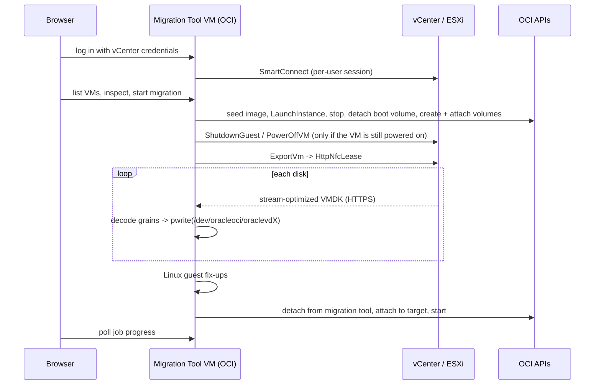
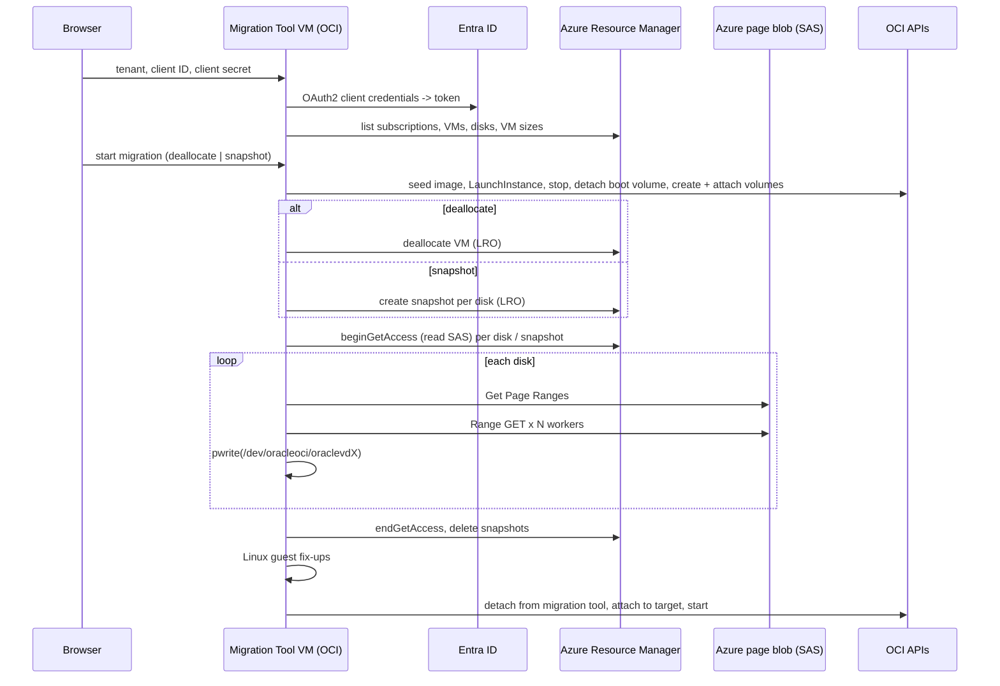
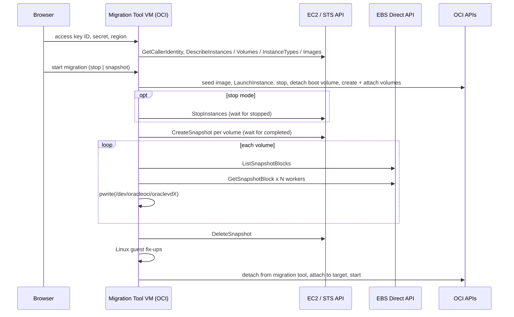
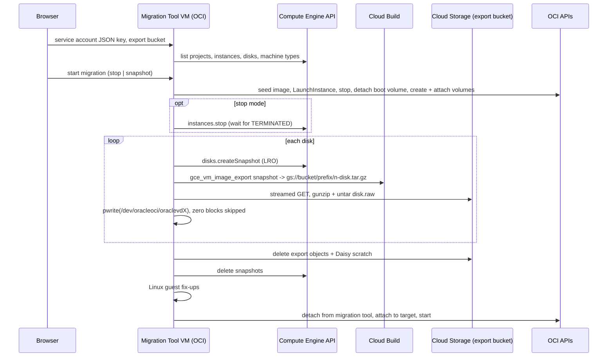

# How the OCI Ultimate Migration Tool works

Technical overview of the OCI Ultimate Migration Tool: what happens on the OCI side for every migration,
how each source platform is read, how the extra features work, and the network flows. For the
step-by-step internals see [architecture.md](architecture.md); for the guest OS / launch option / shape
tables see [os-mapping.md](os-mapping.md); for known limitations and troubleshooting see
[limitations.md](limitations.md); for deployment and configuration see [install-helper.md](install-helper.md).

Contents

- [The OCI side, shared by all migrations](#the-oci-side-shared-by-all-migrations)
- Migration options: [VMware vCenter / ESXi](#vmware-vcenter--esxi),
  [Oracle Linux Virtualization Manager](#oracle-linux-virtualization-manager), [Microsoft Azure](#microsoft-azure),
  [Amazon EC2](#amazon-ec2), [Google Cloud Compute Engine](#google-cloud-compute-engine),
  [Import OVA/OVF from Object Storage](#import-ovaovf-from-object-storage)
- Extra features: [Create OCI instance from ISO](#create-oci-instance-from-iso),
  [OCI Remote Console](#oci-remote-console), [Export OCI instance to OVA/OVF](#export-oci-instance-to-ovaovf)
- [Linux guest fix-ups](#linux-guest-fix-ups), [Networking](#networking)

## The OCI side, shared by all migrations

Everything runs on a single VM in OCI, the **OCI Migration Tool VM**. Migrations run **without VDDK and
without temporary storage on that VM**: source disks are streamed straight onto OCI block volumes that
are attached to the tool VM while the copy runs. Every source (VMware, OLVM, Azure, AWS, Google Cloud, OVA)
ends in the same pipeline; only the way the source disks are read differs. OLVM is read the same way as
VMware: the VM is shut down, then its disks are streamed straight onto the OCI volumes.

1. **Seed image.** The tool registers a tiny *seed* custom image matching the VM's firmware (BIOS/UEFI),
   Secure Boot and operating system (reused for later VMs with the same combination) and launches the
   target instance from it with the right launch options (boot volume type, NIC type, Windows licensing).
   The instance is then stopped and its boot volume detached.
2. **Volumes.** Data volumes are created; boot and data volumes are attached to the tool VM.
3. **Copy.** The source disks are streamed onto the attached volumes (`pwrite()` at the right offsets;
   unallocated regions are skipped because fresh OCI volumes read as zero). Progress, throughput and
   retries are tracked per disk; a failed disk attempt restarts from the beginning of that disk.
4. **Guest fix-ups.** For Linux guests the copied boot volume is mounted once and prepared for first boot
   in OCI (see [Linux guest fix-ups](#linux-guest-fix-ups)).
5. **Finalize.** The volumes are detached from the tool VM, attached to the target instance, and the
   instance is started.

The target (compartment, VCN/subnet, shape, OCPUs/memory, Windows license type) is chosen per VM on the
export form; the shape is pre-sized from the source (2 vCPU = 1 OCPU). Several jobs run in parallel
(configurable on *Setup*), further jobs queue. Cancel and failure clean up whatever the job created on
the source side (export access, snapshots, staging objects); the source VM's disks are never modified.

## VMware vCenter / ESXi

You log in to the web UI with your vCenter (or ESXi) credentials, pick a VM, choose the OCI target and
start. After the OCI side is prepared (steps 1 and 2 above) the tool:

- shuts the source VM down if it is still powered on (confirmed by the operator when starting the job:
  guest OS shutdown through VMware Tools, hard power-off as fallback);
- opens an `HttpNfcLease` (the mechanism behind *Export OVF*) on vCenter and streams each disk as a
  stream-optimized VMDK straight from vCenter, decoding the compressed grains on the fly and writing them
  at their offsets on the attached OCI volumes. No OVA is ever written to disk.

### Supported endpoints

The tool talks plain vSphere API (pyVmomi `SmartConnect`) and NFC over HTTPS, so it works with either
management endpoint. The server address is entered on the login page, so one tool VM can serve several.

| Source | Log in as | Notes |
| --- | --- | --- |
| **vCenter Server** (7.0 or later recommended; 6.5/6.7 work) | a vCenter/SSO user, e.g. `user@vsphere.local` or a domain account | Full inventory (folders, all hosts/clusters). Disks are streamed through the vCenter proxy by default; *Download the disks directly from the ESXi host* (export page, *Advanced*) bypasses it when the tool can reach the hosts on 443 and is usually several times faster. |
| **Standalone ESXi host** (6.5 or later) | a local host user, typically `root` | Connect to the host's own address. Only the VMs registered on that host are listed (folder shows as `ha-datacenter/vm`); the export streams from the host itself. Also useful for hosts still managed by a vCenter that the tool cannot reach. |

### Requirements

The account needs `VirtualMachine.Provisioning.ExportOVF` / *Allow disk access* on the VMs (plus
`VirtualMachine.Interact.PowerOff` when the tool is to shut the VM down). The tool VM must reach the
endpoint on 443 (or the port given at login) over your VPN/FastConnect. The VM must be powered off during
the copy (the tool shuts it down otherwise). Encrypted VMs (including Windows 11 with a vTPM) cannot be
exported by vSphere; decrypt them first. vSphere Hosted (Workstation/Fusion), Hyper-V and unmanaged KVM
(a host that is not managed by OLVM) are **not** supported - see [limitations.md](limitations.md).

## Oracle Linux Virtualization Manager

You log in with an engine URL, user name and password (for example `admin@ovirt` on a Keycloak engine, or
`admin@internal`). A Keycloak user such as `admin@ovirt` is sent to the engine as `admin@ovirt@internal`,
because `internal` is the authz profile and `@ovirt` is part of the user name. The password stays
in memory for the browser session (`POST /api/auth/olvm/login`). The tool lists the engine's virtual
machines (`GET /api/olvm/vms`) and maps each one to a `VmSpec` (`olvm/inventory.py`): SeaBIOS or OVMF /
Secure Boot, CPU topology and memory, the boot disk first, and the guest OS. The guest agent
(`guest_operating_system`: distribution and version, for example Ubuntu 26.04) is used when OLVM has it;
the configured `os.type` (`rhel_9x64`, `ol_8x64`, `windows_2022`, …) is the fallback. On the migration
form you can change the operating system and release recorded on the OCI image.

After the OCI side is prepared the tool:

- shuts the source VM down if it is still up (confirmed by the operator when starting the job: guest
  shutdown through the engine, hard stop if it has not powered off after `HELPER_OLVM_SHUTDOWN_TIMEOUT_S`);
- opens an oVirt image transfer (`direction=download`, `format=raw`) per disk and streams the allocated
  extents from the engine image proxy (`proxy_url`, typically port 54323) onto the attached OCI volumes.
  Zero extents are skipped. Current OLVM does not return a signed ticket; the proxy URL is the credential.
  The transfer is finalized (`POST .../finalize`) when the disk is copied and cancelled
  (`POST .../cancel`) if the job fails or is cancelled, which is what releases the disk lock. A transfer
  already holding the disk is cancelled first. No OVA is written.

The tool VM must reach the engine on HTTPS (API and the SSO token endpoint) and the image proxy. Direct
LUN disks, the hosted-engine VM, disks that are not `ok`, and VMs that are migrating or otherwise
transient are refused before anything is created in OCI. The VM stays powered off afterwards. There is
no snapshot-while-running mode.

## Microsoft Azure

You log in with a *service principal* (tenant ID, application/client ID, client secret - held in memory
per session like vCenter credentials; `POST /api/auth/azure/login`). The tool lists the VMs of every
subscription the principal can read (`GET /api/azure/vms`) and maps each VM to a `VmSpec`
(`azure/inventory.py`): Hyper-V generation V1 -> BIOS, V2 -> UEFI, Trusted Launch Secure Boot / vTPM,
vCPU and RAM from the VM size, the OS disk first and the data disks in LUN order, the guest OS from the
image reference (publisher/offer/SKU) and the instance view so that `oci/mapping.py` recognises Ubuntu,
RHEL, Oracle Linux, SUSE and Windows as it does for vSphere.

Azure managed disks are exported through a **read SAS** on the disk (`beginGetAccess`), which Azure only
grants while the disk is not attached to a running VM. Per job you choose how the disks are captured:

- **Deallocate the VM** and export its disks: consistent copy; the VM is deallocated right before the
  export (after the OCI instance and volumes are prepared; confirmed by name when the job is started) and
  stays deallocated afterwards.
- **Snapshot the disks** while the VM keeps running: the tool creates a snapshot of every disk, exports
  the snapshots and deletes them when the job ends. Crash-consistent (like a power loss); changes made
  after the snapshot are not migrated.

The SAS points at a fixed-VHD **page blob**. The tool asks the blob for its allocated ranges
(`GET ?comp=pagelist`), downloads only those with `HELPER_AZURE_RANGE_WORKERS` parallel range requests of
`HELPER_AZURE_RANGE_CHUNK_BYTES` (`disk/vhd_range_copy.py`) and writes them at the same offsets on the
attached OCI volume - the trailing 512-byte VHD footer is left out. Progress is exact (`stream_bytes` =
allocated bytes). The SAS is revoked (`endGetAccess`) and the snapshots deleted when the copy finishes,
fails or is cancelled; an expired SAS (`HELPER_AZURE_SAS_DURATION_S`, default 24 h) is renewed mid-copy.

### Supported sources and requirements

| Source | Log in as | Notes |
| --- | --- | --- |
| **Azure (public cloud)** - VMs with managed disks in any subscription of one Entra ID tenant | a *service principal*: tenant ID, application (client) ID, client secret | The principal needs **Reader** on the subscriptions plus `Microsoft.Compute/virtualMachines/deallocate/action`, `Microsoft.Compute/disks/beginGetAccess/action`, `disks/endGetAccess/action`, `snapshots/write`, `snapshots/delete`, `snapshots/beginGetAccess/action`, `snapshots/endGetAccess/action` on the resource groups holding the VMs (the built-in *Virtual Machine Contributor* + *Disk Snapshot Contributor* + *Disk Restore Operator* roles cover them; *Disk Snapshot Contributor* alone does not include `disks/endGetAccess`; the login page shows a custom-role snippet). Unmanaged (storage account) disks, ephemeral OS disks, Azure Disk Encryption, Confidential VMs and disks with `networkAccessPolicy = DenyAll` are refused before anything is created in OCI; disks restricted to a private endpoint (`AllowPrivate`) need that endpoint reachable from the tool VM. Azure Government / China clouds and Azure Stack are not supported. |

The tool VM must reach `login.microsoftonline.com`, `management.azure.com` and the blob endpoints of the
export SAS (`*.blob.core.windows.net` or `*.blob.storage.azure.net`) on 443 (NAT gateway or internet
route; there is no OCI service gateway for Azure). Azure charges internet egress for the data leaving the
region.

## Amazon EC2

You log in with an IAM user **access key** (access key ID, secret access key, EC2 region; held in memory
per session; requests are SigV4-signed by the tool, `aws/sigv4.py`). The tool lists the instances of that
region (`GET /api/aws/vms`) and maps each to a `VmSpec` (`aws/inventory.py`): firmware from the
instance's boot mode (legacy-bios / uefi), vCPU and RAM from the instance type, the root volume first and
the EBS data volumes in device order, the guest OS from the platform details and the AMI name/description.

Per job you choose how the volumes are captured:

- **Stop the instance** and snapshot its volumes: consistent copy; the instance is stopped right before
  the export (after the OCI side is prepared; confirmed by name when the job is started) and stays
  stopped afterwards.
- **Snapshot the volumes** while the instance keeps running: crash-consistent; changes made after the
  snapshot are not migrated.

In both modes the tool creates one **EBS snapshot per volume** (tagged with the job ID) and reads it with
the **EBS Direct APIs**: `ListSnapshotBlocks` returns the allocated blocks (512 KiB), `GetSnapshotBlock`
fetches them with `HELPER_AWS_RANGE_WORKERS` parallel workers (`disk/ebs_range_copy.py`), and each block
is written at its offset on the attached OCI volume. No S3 export bucket and no AMI are needed. The
snapshots are deleted when the job finishes, fails or is cancelled.

### Supported sources and requirements

| Source | Log in as | Notes |
| --- | --- | --- |
| **Amazon EC2** (one region per login) | IAM user access key ID, secret access key, region | The user needs `ec2:DescribeInstances`, `DescribeVolumes`, `DescribeSnapshots`, `DescribeInstanceTypes`, `DescribeImages`, `StopInstances`, `CreateSnapshot`, `DeleteSnapshot`, `CreateTags`, `ebs:ListSnapshotBlocks`, `ebs:GetSnapshotBlock`, and `kms:Decrypt` / `DescribeKey` / `CreateGrant` for encrypted volumes (the login page shows a ready-made IAM policy). Instance-store root volumes and Marketplace AMIs with product codes are refused before anything is created in OCI. |

The tool VM must reach `sts.<region>.amazonaws.com`, `ec2.<region>.amazonaws.com` and
`ebs.<region>.amazonaws.com` on 443 (NAT gateway or internet route). AWS charges snapshot storage until
the job deletes the snapshots, plus egress for the data leaving the region.

## Google Cloud Compute Engine

You log in with a **service account JSON key** and the name of a **GCS export bucket** (both held in
memory per session; the key is exchanged for an OAuth2 token with a signed JWT, `gcp/client.py`). The
tool lists the instances of the projects the service account can see (`GET /api/gcp/vms`) and maps each
to a `VmSpec` (`gcp/inventory.py`): UEFI firmware (Compute Engine instances boot UEFI) with Secure Boot
from the Shielded VM settings, vCPU and RAM from the machine type, the boot disk first and the persistent
data disks in device order, the guest OS from the boot disk's source image or licenses and the instance
labels/description.

Per job you choose how the disks are captured:

- **Stop the instance** and export its disks: consistent copy; the instance is stopped right before the
  export (after the OCI side is prepared; confirmed by name) and stays stopped afterwards.
- **Snapshot the disks** while the instance keeps running: crash-consistent.

Compute Engine has no REST call that reads a disk block by block, so the export goes through Cloud
Storage. For every disk the tool creates a **snapshot** (labelled with the job ID) and runs Google's
`gce_vm_image_export` **Cloud Build** workflow, which writes the snapshot as `disk.raw` inside a
`<prefix>/<n>-disk.tar.gz` object in your export bucket (`gcp/export.py`). The tool then streams that
object (`disk/gcs_range_copy.py`), gunzips and un-tars it on the fly and writes `disk.raw` onto the
attached OCI volume, skipping all-zero blocks. When the job finishes, fails or is cancelled it deletes
the export objects, the Cloud Build scratch data (`<project>-daisy-bkt-<region>`) and the snapshots.

### Supported sources and requirements

| Source | Log in as | Notes |
| --- | --- | --- |
| **Google Compute Engine** - instances with persistent disks in the projects the service account can read | a *service account* JSON key plus a GCS export bucket | On the VM projects the service account needs `roles/compute.viewer`, `roles/compute.instanceAdmin.v1` (stop), `roles/compute.storageAdmin` (snapshots) and `roles/cloudbuild.builds.editor` (run the export), plus `roles/iam.serviceAccountUser` on the project's default Compute Engine service account, which Cloud Build runs as; that default service account and the migration service account both need `roles/storage.objectAdmin` on the export bucket. The login page's *(i)* dialog contains a `gcloud` script that creates all of this. Local SSD/scratch disks are refused; disks with customer-managed encryption keys need `cloudkms.cryptoKeyVersions.useToDecrypt` on the key; Confidential VMs are exported with a warning (validate first boot). |

The tool VM must reach `oauth2.googleapis.com`, `compute.googleapis.com`, `cloudbuild.googleapis.com`,
`cloudresourcemanager.googleapis.com` and `storage.googleapis.com` on 443 (NAT gateway or internet
route). Google charges snapshot and bucket storage until the job deletes them, Cloud Build minutes for
the export, and egress for the data leaving the region. The export runs at Cloud Build speed
(`HELPER_GCP_EXPORT_TIMEOUT_S`, default 2 h per disk).

## Import OVA/OVF from Object Storage

For VMs that are not reachable from the tool VM you upload an **`.ova`**, an **`.ovf` with its VMDKs**,
or a **single `.vmdk`** to an OCI Object Storage bucket (the form can upload it for you through a
pre-authenticated request) and pick it on the *Import OVA* page. The tool reads the OVF descriptor
(`ova/ovf.py`: disks, capacities, firmware, boot disk), asks you to confirm operating system and firmware,
and then runs the shared pipeline:

1. `parse_ova_layout` (`ova/package.py`) resolves where every VMDK lives: an object next to the `.ovf`,
   or a member inside the `.ova` tar (read by seeking through the tar stream).
2. Seed image, placeholder instance, boot and data volumes as for every migration.
3. Each VMDK is streamed from Object Storage (`disk/object_vmdk_copy.py`), the stream-optimized grains are
   decoded on the fly and written onto the attached OCI volume, exactly like the vSphere NFC stream.
4. Linux guest fix-ups, then finalize.

No custom-image import is involved, so multi-hundred-GB VMDKs are not limited by the image import
service, and nothing is extracted or duplicated in the bucket.

## Create OCI instance from ISO

Pick an installer ISO in an Object Storage bucket, an OS type, firmware (BIOS/UEFI, Secure Boot), a shape
(x86 or Ampere A1/A2/A4 flex VM with OCPUs and memory, or a bare metal shape) and a boot volume size. The
tool (`oci/iso_install.py`):

1. imports the ISO as a **custom image** (source image type `VMDK`; OCI recognises ISO content and treats
   the image as boot media). Images are tagged with the ISO object, its ETag, firmware and device model
   and reused by later jobs from the same ISO;
2. launches the instance from that image with a **blank boot volume** of the requested size and the right
   launch options (paravirtualized devices by default, IDE + E1000 with *Maximum compatibility* for
   installers without virtio drivers, e.g. Windows Setup);
3. leaves the job in *INSTALLING* and hands you the [remote console](#oci-remote-console). Install the
   operating system onto the boot volume and reboot; the instance then boots from the boot volume. *Installation
   finished* completes the job.

Nothing is copied by the tool VM in this flow.

## OCI Remote Console

For a completed migration (and for an ISO installation) the job view offers *Remote console*: the tool
creates an OCI *instance console connection* for the instance with a temporary RSA key (kept in memory
only, tagged `oci-umt=console`), opens the VNC tunnel of that connection itself (two SSH hops through
the console service with asyncssh, host key checked against the fingerprint OCI reports) and bridges the
RFB stream into a WebSocket on `/api/jobs/{id}/console/vnc`, where [noVNC](https://github.com/novnc/noVNC)
(vendored under `ui/vendor/novnc`) renders it in the browser. Requires the session cookie and a
same-origin page. The console connection is deleted when the console is closed, after
`HELPER_CONSOLE_IDLE_TIMEOUT_S` (default 600 s) without a viewer, or when the tool shuts down. OCI
allows one console connection per instance: a leftover created by the tool is replaced silently, one
created elsewhere only after confirmation. `manage instance-family` (already in the stack's policy)
covers `instance-console-connection`.

The *OCI Remote Console* box on the start page offers the same console for **any** instance, without a
job: `GET /api/instances?compartment_id=` lists the instances of a compartment (`ListInstances`),
`GET /api/instances/search?q=` finds instances by display name across compartments with OCI Resource
Search (`query instance resources where displayName =~ '<text>'`), and `/api/instances/{ocid}/console`
(`POST`/`GET`/`DELETE` and the `/vnc` WebSocket) mirrors the job endpoints. The console manager keys
these sessions by the instance OCID; a session already open through a job for the same instance is
reused, so there is never more than one connection per instance.

## Export OCI instance to OVA/OVF

The reverse direction: pick an existing instance and a destination bucket. The tool (`oci/ova_export.py`):

1. takes a second, *shareable* attachment of every block (data) volume on itself - the volumes **stay
   attached** to the instance (a non-shareable attachment is converted first while the instance is still
   running);
2. **stops** the instance, detaches its **boot volume** and attaches it to itself;
3. **streams each disk** as a stream-optimized VMDK into the bucket: `os.pread` of 64 KiB grains, all-zero
   grains omitted, multipart upload; then writes an OVF descriptor and a SHA-256 manifest next to the
   VMDKs (`prefix/name.ovf`, `prefix/name-diskN.vmdk`, `prefix/name.mf` - an OVF set, not a single `.ova`
   tar);
4. **reattaches** the boot volume and releases its data volume attachments. The instance is **left
   STOPPED**.

Cancel and failure run the same restore; the tool never terminates the instance or deletes its volumes.
The tool VM itself cannot be exported. IAM must allow the tool to manage that instance and its volumes
(the same `instance-family` / `volume-family` scope as the rest of the tool).

## Linux guest fix-ups

After the copy and before finalize, Linux boot volumes are mounted once on the tool VM (`guest/fixup.py`)
and prepared for first boot in OCI; every step is optional under *Advanced: firmware and device model*.

- **initramfs** (`guest/initramfs.py`): rebuilds the initramfs with virtio drivers where it lacks them
  (the guest's own dracut in a chroot; RHEL-family host-only images otherwise cannot find their root disk
  in OCI).
- **Network** (`guest/network.py`): makes the guest configure its renamed network interface with DHCP
  (NetworkManager profile matching any Ethernet device, first-boot unit for legacy network-scripts,
  netplan/networkd drop-ins; MAC-pinned udev rules disabled).
- **Cloud clean-up** (`guest/azure_cloud.py`, `aws_cloud.py`, `gcp_cloud.py`): points cloud-init at the
  Oracle datasource so it does not wait for the Azure/EC2/GCE metadata service, removes the source cloud's
  cloud-init drop-ins, disables its guest agents (walinuxagent, Amazon SSM / CloudWatch agents, Google
  guest units) and, for Azure, comments out `/dev/sr0` entries in `fstab` that stall the boot. For AWS it
  also rewrites the kernel options (BLS entries, `grubenv`, `grub.cfg`, `/etc/default/grub`): Amazon Linux
  boots with `quiet rd.shell=0 rd.emergency=poweroff`, which hides the boot and powers the instance off when
  the root disk is not found; those are dropped and `earlycon` is added so the OCI serial console shows what
  happens.

Windows guests are not modified; they need the Oracle VirtIO drivers installed before the migration, or
the *Maximum compatibility* preset (IDE + E1000) - see [limitations.md](limitations.md).

## Networking

| Flow | Port | Notes |
| --- | --- | --- |
| Browser -> migration tool | TCP 8443 | web UI + API, TLS (self-signed by default), restricted by `allowed_source_cidrs` |
| Migration tool -> OLVM engine | TCP 443 | OLVM source only: engine REST API and the SSO token endpoint |
| Migration tool -> OLVM image proxy | TCP 54323 | OLVM source only: image-transfer download (the engine proxies the hosts). Used when the transfer returns a `proxy_url`; otherwise the host imageio port 54322 |
| Migration tool -> vCenter | TCP 443 | SOAP API and the NFC disk download (vCenter proxies ESXi by default) |
| Migration tool -> ESXi hosts | TCP 443 | Only with *Download the disks directly from the ESXi host* (per migration) or `HELPER_NFC_HOST_OVERRIDE`; bypasses the vCenter proxy, usually several times faster |
| Migration tool -> `login.microsoftonline.com`, `management.azure.com` | TCP 443 | Azure source only: Entra ID token, Azure Resource Manager (VM inventory, deallocate, snapshots, export SAS). Needs a NAT gateway or other internet route |
| Migration tool -> `*.blob.core.windows.net` / `*.blob.storage.azure.net` | TCP 443 | Azure source only: the page-blob download behind the export SAS (`Get Page Ranges` + range `GET`s). Same route as above |
| Migration tool -> `sts.<region>.amazonaws.com`, `ec2.<region>.amazonaws.com`, `ebs.<region>.amazonaws.com` | TCP 443 | AWS source only: STS identity, EC2 inventory/stop/snapshot, EBS Direct block reads |
| Migration tool -> `oauth2.googleapis.com`, `compute.googleapis.com`, `cloudbuild.googleapis.com`, `cloudresourcemanager.googleapis.com`, `storage.googleapis.com` | TCP 443 | Google Cloud source only: service account token, Compute Engine inventory/stop/snapshots, Cloud Build export, GCS object download |
| Migration tool -> OCI | TCP 443 | Compute, Block Storage, Object Storage APIs (service gateway or NAT) |
| Migration tool -> `instance-console.<region>.oci.oraclecloud.com` | TCP 443 | *Remote console*: SSH to the OCI console connection service (Service Gateway with *All Services in Oracle Services Network*, or NAT gateway; the migration tool has no public IP). The VNC stream is bridged to the browser over the existing 8443 connection (WebSocket). |
| Migration tool -> Oracle Linux yum repositories, GitHub, PyPI | TCP 443 | Installation and *Setup -> Update now* (`dnf`, `git`, `pip`). The Oracle yum servers are in the Oracle Services Network (Service Gateway); GitHub and PyPI need a NAT gateway |
| Administrator -> migration tool | TCP 22 | Optional SSH administration, same `allowed_source_cidrs` as the web UI |

All flows are TCP and are initiated by the browser or by the migration tool VM; nothing has to reach into
your on-premises network from OCI, and the target instances need no inbound ports. The Resource Manager
stack creates a network security group with the 8443/22 ingress rules for the administrators' CIDRs and
unrestricted egress; the migration tool VM's subnet route table must provide the paths above
(VPN/FastConnect to on-premises VMware if you use it, Service Gateway and NAT gateway to OCI and the
internet for cloud sources).
